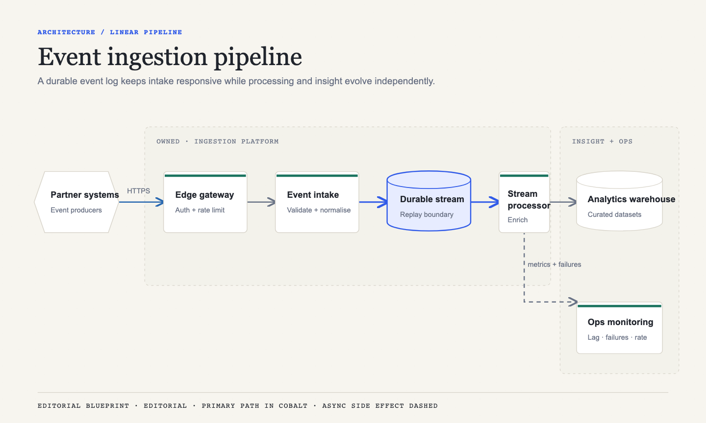
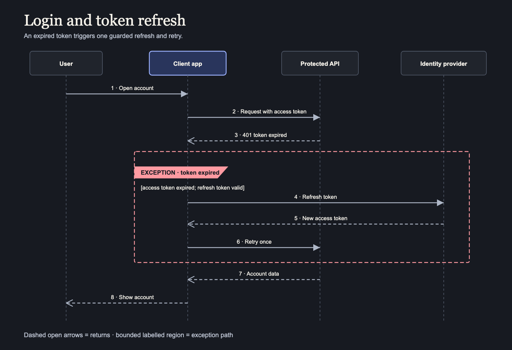

# Diagrammatical

Gorgeous, purposeful diagrams generated inside Claude Code — structured, brandable, and easy to revise conversationally.

Diagrammatical is an installable specialist diagram designer that turns repositories, prose, plans
and supported Mermaid into editable semantic sources plus polished, self-contained HTML and SVG.
It reports what it simplified and keeps visual review distinct from mechanical validation.

## Supported outcomes

Diagrammatical supports architecture, flowchart, sequence, site-map/tree and Gantt diagrams through
one shared workflow. Ask naturally: `Create a flowchart for this process.` Revision is conversational
too: `Keep the meaning, but make the successful path clearer and use the executive style.`

The plugin currently ships Editorial, Technical, Executive, Clinical, and Neutral art directions, light and dark static base templates, and a rendered calibration sheet. Validate a diagram, brand, or project configuration with:

```bash
python skills/diagrammatical/scripts/validate.py path/to/source.yaml --schema diagram --json
```

Diagram output uses the default four-file structure:

```text
diagrams/<diagram-slug>/
├── diagram.yaml
├── <diagram-slug>.html
├── <diagram-slug>.svg
└── validation.json
```

PNG remains explicit-only.

Reviewed SVG examples live under `skills/diagrammatical/assets/examples/`; visual regression
screenshots are maintained under `tests/visual/baselines/`.





Choose Editorial, Technical, Executive, Clinical or Neutral art direction independently of the
selected built-in or project-owned brand.

## Project branding

Ask:

```text
Configure Diagrammatical using the branding in this repository.
```

Or run `/diagrammatical:brand`. Diagrammatical proposes semantic mappings, checks contrast,
generates a calibration preview, and requests approval before saving reusable files under
`.diagrammatical/`. Brand identity remains independent from the five built-in art directions, and
one diagram can safely override semantic presentation tokens without changing the shared brand.

See [branding](docs/branding.md) and [configuration](docs/configuration.md) for manual, CSS,
Tailwind, token JSON, website, dark-variant, calibration, and override guidance.

## Install in Claude Code

Install from the public marketplace repository:

```text
/plugin marketplace add paulmorrishhl/diagrammatical
/plugin install diagrammatical@diagrammatical
```

Then use ordinary conversation:

```text
Generate an architecture diagram of this repository.
```

Explicit commands are also discoverable:

```text
/diagrammatical:create
/diagrammatical:brand
/diagrammatical:variants
/diagrammatical:restyle
/diagrammatical:import-mermaid
/diagrammatical:validate
/diagrammatical:export
```

`create` handles all five diagram types; `brand` proposes project-owned identity; `variants`
changes composition; `restyle` changes presentation; `import-mermaid` performs a safe editorial
redraw; `validate` runs checks; and `export` extracts SVG or explicitly renders PNG.

## Mermaid and export

```text
/diagrammatical:import-mermaid docs/login-sequence.mmd
/diagrammatical:export diagrams/login-sequence/login-sequence.html --format svg
/diagrammatical:export diagrams/login-sequence/login-sequence.html --format png
```

Mermaid is parsed, never executed. Supported v1 grammars are flowchart/graph, sequenceDiagram and
Gantt. PNG requires `pip install -e '.[export]'` and `playwright install chromium`; ordinary creation,
branding, validation and import never generate PNG. See [Mermaid import](docs/mermaid-import.md) and
[export](docs/export.md).

## Local development

Requirements: Python 3.11 or newer and a current Claude Code installation.

```bash
python -m venv .venv
source .venv/bin/activate
python -m pip install -e ".[dev]"
ruff check .
pytest
python scripts/verify_package.py
python scripts/release_check.py
```

Test the plugin from a local checkout with either:

```bash
claude --plugin-dir .
```

or add the checkout as a local marketplace in Claude Code:

```text
/plugin marketplace add /absolute/path/to/diagrammatical
/plugin install diagrammatical@diagrammatical
```

Run `/reload-plugins` after reinstalling. See [troubleshooting](docs/troubleshooting.md) when a local
checkout and Claude's cached plugin differ.

## Security and limitations

Repository and imported content are untrusted data. Outputs prohibit scripts, event handlers and
remote resources; Mermaid directives and URLs are rejected; Tailwind JavaScript is not executed;
browser export blocks network requests. Diagrammatical does not support draw.io, Mermaid rendering,
automatic layout, a hosted editor, font redistribution or automatic PNG generation.

Configuration and semantic source details are in [configuration](docs/configuration.md),
[branding](docs/branding.md) and [diagram source](docs/diagram-source.md). Contributors should read
[contributing diagram types](docs/contributing-diagram-types.md), [release guidance](docs/releasing.md),
[CONTRIBUTING.md](CONTRIBUTING.md), [SECURITY.md](SECURITY.md) and the third-party notices.

## Licence

Diagrammatical is available under the [MIT License](LICENSE).
