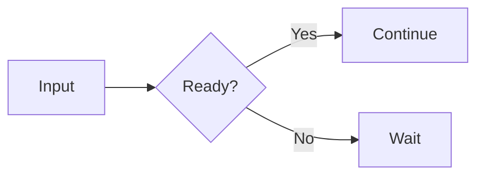
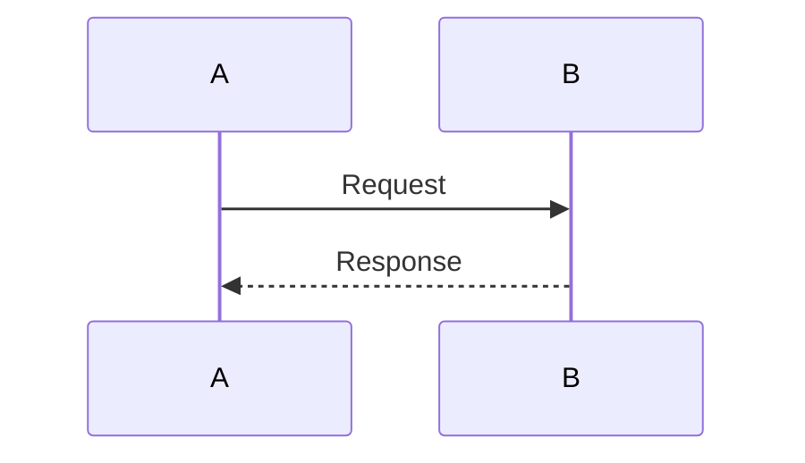

# Diagrams

```mermaid
flowchart LR
  a[Input] --> b{Ready?}
  b -->|Yes| c[Continue]
  b -->|No| d[Wait]
```

```mermaid
sequenceDiagram
  participant A
  participant B
  A->>B: Request
  B-->>A: Response
```
